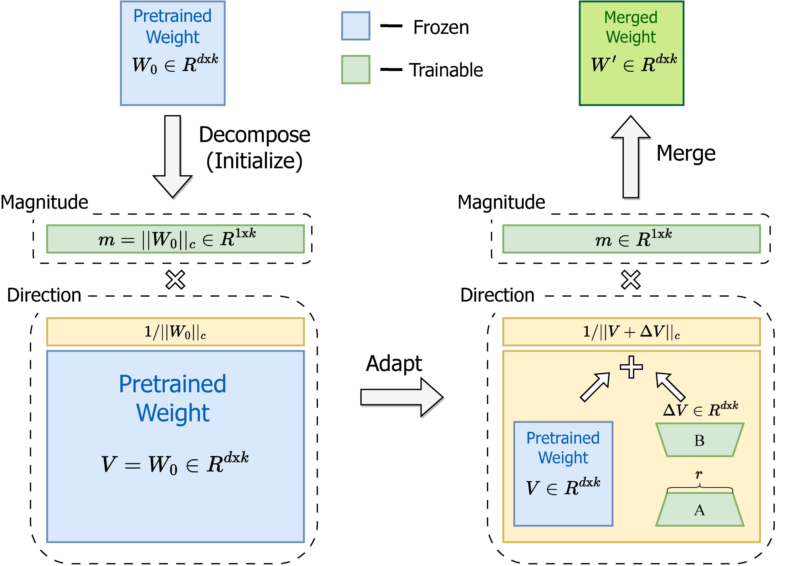
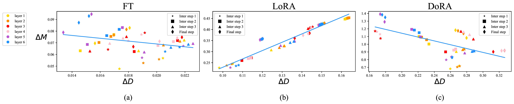
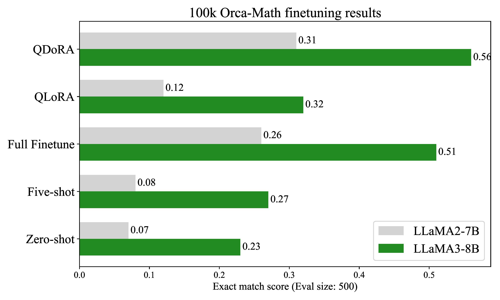
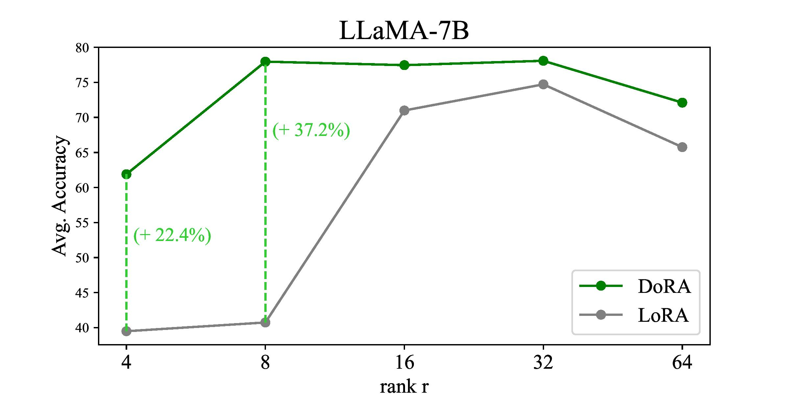
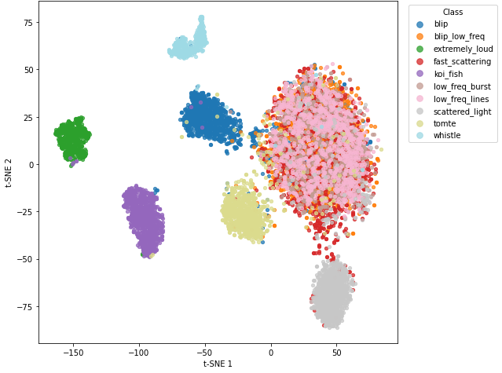
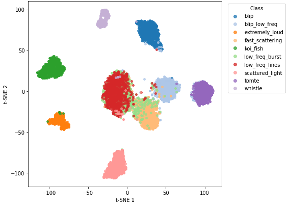

# DoRA: Weight-<i>D</i>ecomposed L<i>o</i>w-<i>R</i>ank <i>A</i>daptation
### Authors: Shih-Yang Liu, Chien-Yi Wang, Hongxu Yin, Pavlo Molchanov, Yu-Chiang Frank Wang, Kwang-Ting Cheng, and Min-Hung Chen

**Citation:**
Liu, Shih-Yang, Chien-Yi Wang, Hongxu Yin, et al. “DoRA: Weight-Decomposed Low-Rank Adaptation.” arXiv:2402.09353. Preprint, arXiv, July 9, 2024. https://doi.org/10.48550/arXiv.2402.09353. </br>
Published at the 41st International Conference on Machine Learning (ICML), 2024.

### Presented by: Suyash Deshmukh

---

## Paper Overview

[Five-minute overview providing context, stating the problem the paper is addressing, characterizing the approach, and giving a brief account of how the problem was addressed.]: #

Large pre-trained models like LLaMA and BERT achieve outstanding generalization, but full fine-tuning (FT) — updating every single parameter — is extremely expensive.

To make fine-tuning more efficient, researchers developed Parameter-Efficient Fine-Tuning (PEFT) methods, with LoRA (Low-Rank Adaptation) being one of the most popular.

LoRA inserts small trainable low-rank adapters into existing weight matrices, fine-tunes only those adapters, and merges them back after training.
It’s efficient, elegant, and adds no inference cost.

But - despite its success - LoRA consistently trails full fine-tuning in accuracy. 

Most prior work simply assumed this was due to LoRA’s limited number of trainable parameters, but never looked further into it. The authors of DoRA wanted to change that and investigate this assumption instead of blindly accepting it.

### Question 1:
You are a researcher at Nvidia and you want to get a better understanding of how FT and LoRA change the various matrices in your transformer model during training. How might you be able to <i>decompose</i> (take apart and take a closer look at) the changes in matrices?

<i>Hint: A Matrix is just another way to represent a vector. Scalars are just numbers (just magnitudes)... what is special about vectors?</i>
<details>
    <summary>
        Answer
    </summary>
  You can decompose vectors into a <u>magnitude</u> and a <u>direction</u>!
</details>

<br>

This base concept is what they exploited to understand what is happening under the hood and this is what led to the creation of DoRA!

So, what did they find when they looked into the decomposed matrix changes during training?


### Question 2:
After decomposing the changes in matrices during training, we can get a plot which shows change in direction ($\Delta D$) vs change in magnitude ($\Delta M$). Looking at comparison between FT and LoRA, what can we learn about the way they learn from training?

<i>Hint: There is a clear trend in both subfigures. Is this the same type of trend? What might each trend tell us about the relationship between $\Delta D$ and $\Delta M$?</i>
<details>
    <summary>
        Answer
    </summary>

  FT shows an inverse propotion between $\Delta D$ and $\Delta M$, while LoRA shows a direct propotion! This means that in LoRA bigger changes in direction are always accompanied by bigger changes in magnitude (and vice versa). This is because LoRA does not take advantage of decomposing the matrixes and is unable to fine-tune the direction <u>OR</u> magnitude- only both of them together.

  This is not the case for FT, which has a lot more freedom to learn minor changes and is capable of changing either the direction or the magnitude- leading to higher accuracy.
</details>

<br>

So, to get closer to FT in accuracy, we need the capability to fine-tune the magnitude and direction on their own! This revalation is what led to the creation of DoRA.

### DoRA functions as follows:


1. DoRA decomposes each pre-trained weight W into a magnitude m and direction V.
2. It then fine-tunes both components separately:
    - The magnitude vector m is trained directly.
    - The directional component V is updated efficiently using LoRA’s low-rank matrices.
3. Recombines both parts after training - no extra inference cost, just like LoRA.

This lets DoRA adjust the scale and orientation of weights independently!

They find that DoRA outperforms LoRA on language, vision-language, and reasoning benchmarks; is able to get close to the accuracy of FT; can retain the efficiency of LoRA (only has minimal parameter increase); and can easily be integrated with other PEFT variants.

---

## Architecture Overview - Formal Algorithms
<p>
Below is a <strong>side-by-side formal pseudocode comparison</strong> between <b>LoRA</b> and <b>DoRA</b>.
</p>

<table>
<tr>
<td width="50%" valign="top">

<h3>Algorithm 1: Low-Rank Adaptation (LoRA)</h3>

<hr>

<p><b>Input:</b><br>

Pretrained weight matrix $W_0 \in \mathbb{R}^{d \times k}$,  
training data $\mathcal{D} = \{(x_i, y_i)\}$,  
rank $r \ll \min(d, k)$,  
learning rate $\eta$.
</p>

<hr>

<p><b>Parameters:</b><br>

Trainable low-rank matrices $A \in \mathbb{R}^{r \times k}$, $B \in \mathbb{R}^{d \times r}$.
</p>

<hr>

<ol>
<li>

Initialize $A \leftarrow \text{Uniform Kaiming Distribution}$, $B \leftarrow 0$.</li>
<li>

Repeat for each minibatch $(x, y) \in \mathcal{D}$:</li>
<ul>
<li>

Compute low-rank update: $\Delta W \leftarrow B A$</li>
<li>

Form adapted weight: $W \leftarrow W_0 + \Delta W$</li>
<li>

Forward pass: $\hat{y} \leftarrow f(x; W)$</li>
<li>

Compute loss: $\mathcal{L} \leftarrow \ell(\hat{y}, y)$</li>
<li>

Backpropagate gradients w.r.t. $A, B$</li>
<li>

Update parameters:<br>
$A \leftarrow A - \eta \nabla_A \mathcal{L}$,  
$B \leftarrow B - \eta \nabla_B \mathcal{L}$</li>
</ul>
<li>

Until convergence or max epochs reached.</li>
<li>

Return $W = W_0 + B A$.</li>
</ol>
<hr>

<p><b>

Memory Complexity:</b> $\mathcal{O}(r(d + k))$</p>

</td>

<td width="50%" valign="top" style="border-left:1px solid #ccc; padding-left:15px;">

<h3>Algorithm 2: Weight-Decomposed Low-Rank Adaptation (DoRA)</h3>

<hr>

<p><b>Input:</b><br>

Pretrained weight matrix $W_0 \in \mathbb{R}^{d \times k}$,  
training data $\mathcal{D} = \{(x_i, y_i)\}$,  
rank $r \ll \min(d, k)$,  
learning rate $\eta$.
</p>

<hr>

<p><b>Parameters:</b><br>

Magnitude vector $m = \|W_0\|_c \in \mathbb{R}^{k}$;<br>
Direction matrix $V = \frac{W_0}{\|W_0\|_c} \in \mathbb{R}^{d \times k}$;<br> Trainable magnitude correction $\Delta m \in \mathbb{R}^{k}$;<br>
Low-rank trainable matrices $A \in \mathbb{R}^{r \times k}$, $B \in \mathbb{R}^{d \times r}$.<br>
</p>

<hr>

<ol>
<li>

Initialize $A \leftarrow \text{Uniform Kaiming Distribution}$, $B \leftarrow 0$, $\Delta m \leftarrow 0$.</li>
<li>

Compute base decomposition:<br>
$m \leftarrow \|W_0\|_c$,  
$V \leftarrow W_0 / m$.</li>
<li>

Repeat for each minibatch $(x, y) \in \mathcal{D}$:</li>
<ul>
<li>

Compute low-rank directional update: $\Delta V \leftarrow B A$</li>
<li>

Form adapted weight: $W \leftarrow (m + \Delta m) \cdot \frac{V + \Delta V}{\|V + \Delta V\|_c}$</li>
<li>

Forward pass: $\hat{y} \leftarrow f(x; W)$</li>
<li>

Compute loss: $\mathcal{L} \leftarrow \ell(\hat{y}, y)$</li>
<li>

Backpropagate gradients w.r.t. $A, B$, $\Delta m$.</li>
<li>

Update parameters:<br>
$A \leftarrow A - \eta \nabla_A \mathcal{L}$,  
$B \leftarrow B - \eta \nabla_B \mathcal{L}$,<br>
$\Delta m \leftarrow \Delta m - \eta \nabla_{\Delta m} \mathcal{L}$</li>
</ul>
<li>

Until convergence or max epochs reached.</li>
<li>

Return $W = (m + \Delta m) \cdot \frac{V + \Delta V}{\|V + \Delta V\|_c}$.</li>
</ol>
<hr>

<p><b>

Memory Complexity:</b> $\mathcal{O}(r(d + k) + k)$</p>

</td>
</tr>
</table>

---

## Results!









---

## Critical Analysis
- A limitation of DoRA is that since it is designed to enhance LoRA’s performance to more closely resemble that of FT, in cases where LoRA performs better than / matches FT, the advantage of DoRA shrinks.

- The paper looks at text, images, and videos. However, they must further explore time-series domains such as audio to confirm the generality of directional fine-tuning.

- The comparisons made were to baseline PEFT models (LoRA/VeRA). In the rapidly evolving field that is ML, there are already new PEFT algorithms (such as PiSSA or LoFT). Work must be done to not only compare performances but to see if DoRA concepts might be able to be integrated with new PEFT algorithms for greater performance.

---

## Impact and Relevance
- It is able to get closer to the accuracy of FT while keeping the parameter and inference efficiency of LoRA.

- It is compatible and works as a drop-in replacement for LoRA and can be easily combined with other methods (E.g.: VeRA $\Rightarrow$ DVoRA)

- **Much like LoRA, DoRA lets researchers outside major AI labs fine-tune very large models using limited hardware.**
    - Researchers like me!

---

## Code Demonstration



Getting this big of an improvement in $< 6$ hours of training on ACCRE. 
```java
trainable params: 470,016
all params: 86,657,280
trainable%: 0.5424%
```

---

## References + Resource Links
Include full citations for all external works mentioned above (LoRA, VeRA, QLoRA, etc.)
1. [Official Paper (ICML 2024)](https://github.com/NVlabs/DoRA)
2. [DoRA GitHub Repository](https://github.com/NVlabs/DoRA)
3. [LoRA Original Paper (Hu et al., 2022)](https://arxiv.org/abs/2106.09685)
4. [VeRA Paper (Kopiczko et al., 2024)](https://arxiv.org/abs/2402.10362)
5. [Sebastian Raschka’s DoRA Tutorial](https://sebastianraschka.com/blog/2024/dora.html)